<picture>
  <source media="(prefers-color-scheme: dark)" srcset="./dark.svg">
  <source media="(prefers-color-scheme: light)" srcset="./light.svg">
  
</picture>

 

## About

Software Engineer focused on distributed systems and real-time communication — the kind of infrastructure that has to stay correct under load, not just work in a demo. Currently completing a B.Tech in Computer Science & Business Systems at Heritage Institute of Technology, Kolkata.

**Working areas**
- Distributed architecture — microservices, service discovery, API design
- Real-time systems — WebRTC, WebSockets, low-latency communication
- Full-stack delivery — Spring Boot on the backend, Next.js/React on the front

 

## Education

| | |
|---|---|
| **Degree** | B.Tech, Computer Science & Business Systems |
| **Institution** | Heritage Institute of Technology, Kolkata |
| **Duration** | 2021 – 2025 |

 

## Engineering Stack

**Languages** &nbsp; 

**Backend** &nbsp; 

**Frontend** &nbsp; 

**Infra & Tools** &nbsp; 

**Real-time** &nbsp; `WebRTC` · `WebSockets`

 

## Featured Achievements

<table width="100%">
<tr>
<td width="50%" valign="top">
<h4>Netflix Eureka — Open Source Contributor</h4>
PR #1602 — enhanced service discovery & fault tolerance.
</td>
<td width="50%" valign="top">
<h4>J.P. Morgan Chase — Software Engineering Simulation</h4>
Spring Boot microservices · JPA · REST APIs.
</td>
</tr>
<tr>
<td width="50%" valign="top">
<h4>Smart India Hackathon 2023 — Participant</h4>
Digital workflow solution for government processes.
</td>
<td width="50%" valign="top">
<h4>LeetCode — 250+ Problems Solved</h4>
Arrays · DP · Graphs · Trees.
</td>
</tr>
</table>

 

## GitHub Activity

 

## Connect

<a href="https://souviksportfolio.vercel.app">Portfolio</a> ·
<a href="https://linkedin.com/in/linkwithsouvik">LinkedIn</a> ·
<a href="https://leetcode.com/souRee">LeetCode</a> ·
<a href="https://x.com/reek_me">X</a> ·
<a href="mailto:souvikg3225@gmail.com">Email</a>

